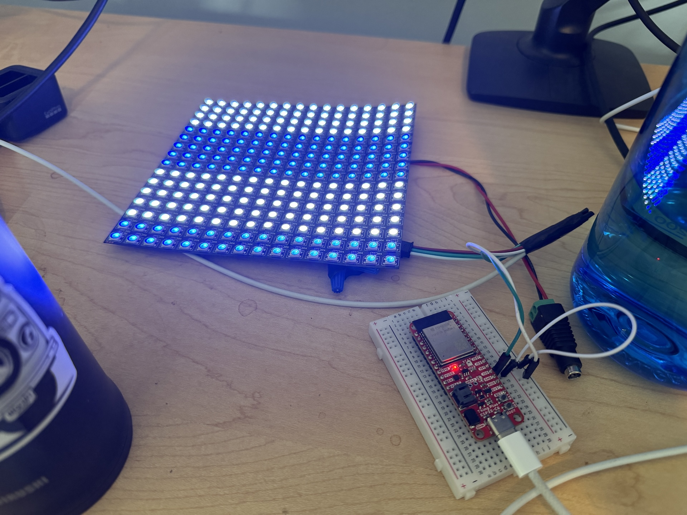
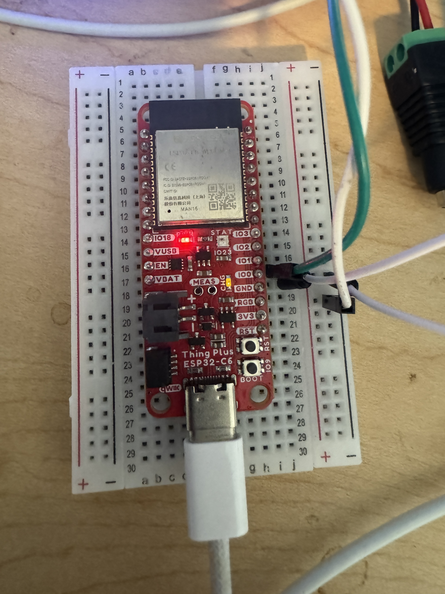

# Embedded Swift LED Strip (LED Matrix)
2024-09-12 

I used the sample code from Apple to start this project and have modified it to include path specific details for Visual Studio code to build the project.

The demo creates a rolling animation by changing the color of X number of rows of pixels.



## TODO: You Must Configure the Files to Your Install

This project is a starting point and compliments my video and blog post on the setup process for Embedded Swift in Visual Studio Code.

You will need to find the paths for your install and update the files accordingly.

## Hardware Required

You can buy the hardware that I'm using for [Embedded Swift on Amazon](https://www.amazon.com/hz/wishlist/ls/313H1I5BBXRNO).

* ESP32-C6 or similar micro controller
* [5V Power supply for LED Strip](https://www.amazon.com/dp/B01D8FM71S/)
* [BTF-LIGHTING WS2812B RGB 16x16 LED Matrix](https://www.amazon.com/dp/B088BTYJH6/)



## Adding New Swift Files to CMakeLists.txt

You need to configure CMake with new files. This can be automated, but any changes to files needs to cause CMake to re-run, or you will have build issues due to missing symbols.

Adding and removing a space to the CMakeLists.txt and saving it should "dirty" the file so that it'll re-run the CMake build process from Visual Studio Code.

```
file(GLOB_RECURSE SWIFT_SOURCES "*.swift")
message(SWIFT_SOURCES="${SWIFT_SOURCES}")

target_sources(${COMPONENT_LIB}
    PRIVATE
    ${SWIFT_SOURCES}
)
```

The alternative is to manually add or remove any Swift files directly.

```
target_sources(${COMPONENT_LIB}
    PRIVATE
    Main.swift
    LedStrip.swift
    Format.swift # Add more files as needed below
)
```

## Configure VS Code

### .vscode/settings.json

Configure your micro controller settings so that you can build and flash from Visual Studio Code.

1. Your device settings, serial port, and settings will be different.
2. Make sure you change the Swift toolchain: `swift-DEVELOPMENT-SNAPSHOT-2024-09-04-a.xctoolchain` to match what you have installed (if Embedded Swift is still experimental)


```
{
    "idf.adapterTargetName": "esp32c6",
    "idf.port": "/dev/tty.usbmodem2101",
    "idf.openOcdConfigs": [
        "board/esp32c6-builtin.cfg"
    ],
    "idf.flashType": "UART",

    "swift.swiftEnvironmentVariables": {
        "DEVELOPER_DIR": "/Applications/Xcode.app"
    },
    "swift.path": "/Library/Developer/Toolchains/swift-DEVELOPMENT-SNAPSHOT-2024-09-04-a.xctoolchain/usr/bin",
    "lldb.library": "/Library/Developer/Toolchains/swift-DEVELOPMENT-SNAPSHOT-2024-09-04-a.xctoolchain/System/Library/PrivateFrameworks/LLDB.framework/Versions/A/LLDB",
    "lldb.launch.expressions": "native"
}
```

### .vscode/c_cpp_properties.json

If you're on macOS, you can probably use this C++ config file as is, so I'll include it.

```
{
    "configurations": [
        {
            "name": "ESP-IDF",
            "compilerPath": "/usr/bin/gcc",
            "compileCommands": "${workspaceFolder}/build/compile_commands.json",
            "includePath": [
                "${config:idf.espIdfPath}/components/**",
                "${workspaceFolder}/**"
            ],
            "browse": {
                "path": [
                    "${config:idf.espIdfPath}/components",
                    "${workspaceFolder}"
                ]
            }
        }
    ],
    "version": 4
}
```


## Code, Build, and Run

After you configure all these steps you should now have code completion working and you should be able to build, flash, and monitor your ESP32 directly from Visual Studio Code.

You should also be able to jump to definition.

After you write your code, you can run it using one command.

1. Set the serial port of your device: Press `F1` (or `Command + Shift + P`), type ESP-IDF: Select Port to Use: and choose the serial port your device is connected. (Connect the USB if not connected)
2. **NOTE**: To stop monitoring, press `Control + ]`. (I don't always have to stop it if I re-run the `ESP Build Flash Monitor` command, but it didn't always work at first)
3. On subsequent runs Visual Studio Code remembers your last command, so that makes it easy to re-build and run the code.

Alternatively, you can use `idf.py` from Terminal:

```
idf.py build flash monitor
```

If you have any questions, tips, or suggestions reach out on X: [@PaulSolt](https://X.com/PaulSolt).

